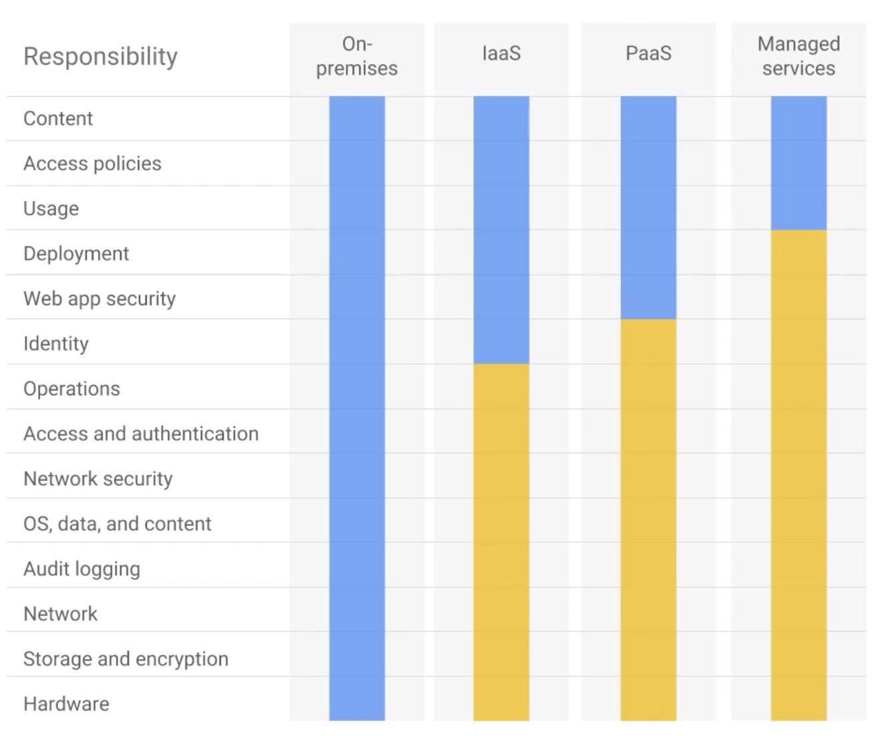

# Cloud computing

## Virtualisation

Virtualisation can be offered on different hardware and software layers, like Central Processing Unit (CPU), disk, memory, filesystems, etc. In this chapter, we will look at some examples of creating virtual machines (VMs) after emulating the different kinds of hardware to install a guest OS on them.

**Virtual machines** are created on top of a hypervisor, which runs on top of the host machine's operating system. With hypervisors, we emulate hardware like CPU, disk, network, memory, etc., and install guest machines on it.

An hypervisor will allow a user to create multiple guest machines with different OSs. For example, we can take a Linux machine running on **bare metal**, install an hypervisor, and create different guest machines that run Linux or Windows. Examples of hypervisors:

- KVM
- VMWare
- VirtualBox

### KVM

- Kernel based Virtual Machine.
- Supports nested guests (a vm running inside a vm).
- Supports **overcommitting**, ie allocating more RAM per vm that the one available in the system. It does that by "borrowing" resources from other guests that are not using those resources.
- Highly scalable.
- Secure since it uses SELinux by default.

### VirtualBox

- By Oracle for Win, Linux and Mac.

### Vagrant

- Cross platform.
- Useful to orchestrate multiple VMs usage.
- It supports Docker.

Installation is configured by a ruby file, `Vagrantfile` that has instructions to handle multiple VMs.
It describes software requirements, packages, operating system configuration, users, and more. An example [here](https://github.com/patrickdlee/vagrant-examples/blob/master/example2/Vagrantfile).

It provides synced folders so that we can share a directory between the VM and the host system. For ex:

```rb
config.vm.synced_folder "../data", "vagrant_data"
```

Will share the local `/data` dir the the `vagrant_data` present in the VM.
**Provisioners** take care of to automatically install software or execute commands after the VM is booted.
For ex. we can tell Vagrant to use the Linux shell to install vim on our guest system:

```rb
config.vm.provision "shell", inline: <<-SHELL
              yum install vim -y
   SHELL
```

## IaaS

Infrastructure as a Service (IaaS) provide physical and virtual resources on demand. We can request storage, load balancers, computing resources etc.

Let's say that you want to have a set of ten Linux systems with 4GB RAM each, and two Windows systems with 8GB each to deploy your software. You can go to any of the IaaS providers and request these systems. Generally, a IaaS provider creates the **respective VMs in the background, puts them in the same internal network, and shares the credentials with you**, thus allowing you to access them. Other than VMs, some IaaS providers offer **bare metal machines** for provisioning.

### Amazon EC2

EC2 is the IaaS solution of Amazon. From the panel or the command line we can request or deallocate resources.
Amazon EC2 uses XEN and **KVM hypervisors** to provision compute resources.

Amazon EC2 provides some preconfigured images, called **Amazon Machine Images (AMIs)**. These images can be used to quickly start instances. We can also create our own custom AMIs to boot our instances.

EC2 supports the provisioning of dedicated hosts, which means we can get an **entire physical machine** for our use.

### Azure

Azure is the IaaS solution of Microsoft.

### DigitalOcean

All of the VMs are created on top of the KVM hypervisor and have SSD (Solid-State Drive) as the primary disk.

### Google Cloud Platform

As you might expect... it's from Google.

## PaaS

Platforms as a Service (PaaS) offer a solution for devs who don't want to worry about the underlying infra.
Some examples are:

- Cloud Foundry
- Openshift: open source, by Red Hat


